  

  
  
  
  

  

 

  I build <strong>backend systems, AI-assisted automation, and full-stack products</strong> that turn complex requirements into reliable software.
   
  My work spans APIs, integrations, data workflows, cloud services, web applications, and mobile development.

 

  

 

  

 

  

 

  
  

 

<h2 align="center">SIGNAL MAP</h2>

  

 

<h2 align="center">OPEN COMMUNICATION CHANNEL</h2>

  Open to conversations about backend engineering, AI automation, software architecture, integrations, and building useful digital products.

  
  

 

  

<!--
  RAILAN ENGINEERING SYSTEM
  Static identity + public GitHub telemetry generated with TypeScript and GitHub Actions.
  Configuration: data/profile.json
  Generator: npm run generate
-->
